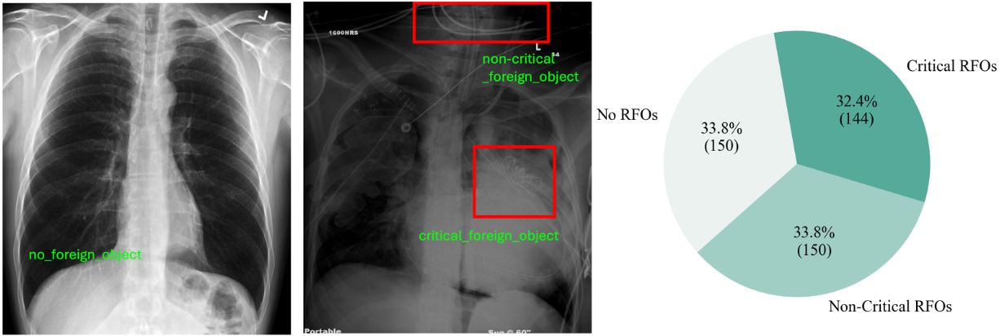

- [Background](#background)
- [Data](#data)
- [Annotation](#annotation)
- [Download](#download)
- [Evaluation](#evaluation)
- [Usage](#usage)
- [Baseline](#baseline)
- [Synthesis](#synthesis)


## Background
Critical retained foreign objects (RFOs), including surgical instruments like sponges and needles, pose serious patient safety risks and carry significant financial and legal implications for healthcare institutions. Detecting critical RFOs using artificial intelligence remains challenging due to their rarity and the limited availability of chest X-ray datasets that specifically feature critical RFOs cases. Existing datasets only contain non-critical RFOs, like necklace or zipper, further limiting their utility for developing clinically impactful detection algorithms. To address these limitations, we introduce "Hopkins RFO Bench" a novel dataset containing 144 chest X-ray images of critical RFO cases collected over 18 years from the Johns Hopkins Health System. Using this dataset, we benchmark several state-of-the-art object detection models, highlighting the need for enhanced detection methodologies for critical RFO cases. Recognizing data scarcity challenges, we further explore image synthesis methods to bridge this gap. We evaluate two advanced synthetic image methods—DeepDRR-RFO, a physics-based method, and RoentGen-RFO, a diffusion-based method—for creating realistic radiographs featuring critical RFOs. Our comprehensive analysis identifies the strengths and limitations of each synthetic method, providing insights into effectively utilizing synthetic data to enhance model training. The Hopkins RFO Bench and our findings significantly advance the development of reliable, generalizable AI-driven solutions for detecting critical RFOs in clinical chest X-rays.

In this project, we 
- Developed and open-access dataset, called [Hopkins RFOs Bench](https://huggingface.co/datasets/Yuliiiiiiiione/Hopkins_RFO_Bench/tree/main), the first and largest dataset of its kind, comprising 144 chest X-ray images containing critical RFOs collected from the Johns Hopkins Health System over the past 18 years.
- Benchmarking existing object detection models on our proposed dataset.
- Evaluating two customized synthetic image generation models, [DeepDRR-RFO]() and [RoentGen-RFO](), for creating images with critical RFOs. We train object detection models using these synthetic images, analyze the strengths and weaknesses of each approach, and provide valuable insights to guide future improvements utilizing our openly accessible dataset.

## Data
Our study, approved by the Johns Hopkins Institutional Review Board. Utilizing the Johns Hopkins mPower search tool, we identified a final critical RFO cohort that consisted of 144 critical RFO cases from 144 distinct patients. A typical frontal chest X-ray without or with foreign objects annotated looks like this:


The composition of our Hopkins RFO Bench dataset is shown in the right sub-figures, comprising 144 critical RFOs cases, 150 No RFOs cases, and 150 No-critical RFOs cases (No RFOs and No-critical RFOs cases are used to construct a class-balanced dataset). We randomly split all images into training, validation, and test datasets with 70%, 10%, and 20%.


## Annotation

We provide image-level and object-level annotations for each image, which indicate the rough location of each foreign object using a closed shape.

Image-level annotation is provided by organizing images into separate folders: one for RFO-positive cases and another for no-RFO cases.

Object-level annotation for each image is provided, which indicates the accurate location of each foreign object using a closed shape. Annotations are provided in a JSON file, and a JSON example is shown below.

Annotations are provided in csv or json files, and a csv example is shown below.

```csv
image_path,annotation
/path/#####.jpg, <ANNO-Number-ID>_<RFO-type>_<ANNO-TYPE-IDX> x1 y1 x2 y2; <ANNO-Number-ID>_<RFO-type>_<ANNO-TYPE-IDX> x1 y1 x2 y2 ... xn yn;...
/path/#####.jpg,
/path/#####.jpg, <ANNO-Number-ID>_<RFO-type>_<ANNO-TYPE-IDX> x1 y1 x2 y2;
/path/#####.jpg, <ANNO-Number-ID>_<RFO-type>_<ANNO-TYPE-IDX> x1 y1 x2 y2 ... xn yn;...
......
...
```
<ANNO-Number-ID> begins at 1 and increments sequentially to uniquely index each annotated instance, covering all types of RFOs across the dataset.

<RFO-types> specifies the classification of each RFO instance and includes two categories: critical (encoded as \texttt{1}) and non-critical (encoded as \texttt{0}).

Three types of shapes are used, namely rectangle and polygon. We use \texttt{0} and \texttt{1} as \texttt{ANNO-TYPE-IDX} respectively.

Two types of shapes are used, namely rectangle, ellipse, and polygon. We use `0`, `1`, and `2` as `ANNO_TYPE_IDX` respectively.

- For rectangle and ellipse annotations, we provide the bounding box (upper left and lower right) coordinates in the format `x1 y1 x2 y2` where `x1` < `x2` and `y1` < `y2`.

- For polygon annotations, we provide a sequence of coordinates in the format `x1 y1 x2 y2 ... xn yn`.


> ### Note:
> Our annotations use a Cartesian pixel coordinate system, with the origin (0,0) in the upper left corner. The x coordinate extends from left to right; the y coordinate extends downward.

## Download
The training and validation dataset can be accessed here at [Hugging Face](https://huggingface.co/datasets/Yuliiiiiiiione/Hopkins_RFO_Bench/tree/main). The imaging data has been anonymized and is free to download for scientific research and non-commercial usage. We only show a subset of the dataset during the review process, but will open all if the paper is accepted. It consists of the following data splits:

### Data Structure

| Type                      | No. (cases) | Format     | Access Link |
| --------------------------| ------------| ---------- | ------------|
| Hopkins RFO Bench         | 144         | jpg & json      | [link](https://huggingface.co/datasets/Yuliiiiiiiione/Hopkins_RFO_Bench/tree/main/Hopkins_RFO_Bench)    |
| Physics-based systhetic images   | 4000        | jpg & csv      | [link](https://huggingface.co/datasets/Yuliiiiiiiione/Hopkins_RFO_Bench/tree/main/Physics-based_rendering_models)    |
| Physics-based rendering models   | 14        | obj   | [link](https://huggingface.co/datasets/Yuliiiiiiiione/Hopkins_RFO_Bench/tree/main/Physics-based_rendering_models)    |
| DDPM-based sythetic images       | 4000         | jpg & csv      | [link](https://huggingface.co/datasets/Yuliiiiiiiione/Hopkins_RFO_Bench/tree/main/DDPM-based%20sythetic%20images)    |

For each data type, the example of a dataset includes the following files (will release the full dataset if the paper gets accepted):

**Dataset organizations**:

1. xxxxx.jpg  % high-resolution chest x-ray images
2. xxxxx.csv  % image-level or object-level annotations
3. xxxxx.json % image-level or object-level annotations
4. xxxxx.obj  % rendering volumes of RFO used for physics-based synthetic methods

## Evaluation
We use two metrics to evaluate the classification and localization performance of foreign objects detection on chest X-rays: Area Under Curve (AUC) and  Free-response Receiver Operating Characteristic (FROC).

### Classification
For the classification task, the baseline model will generate a `prediction_classification.csv` file in the format below:
```
image_path,prediction
/path/#####.jpg,0.90
/path/#####.jpg,0.85
/path/#####.jpg,0.15
...
```
where each line corresponds to the prediction result of one image. The first column is the image path, the second column is the predicted probability, ranging from 0 to 1, indicating whether this image has foreign objects or not.

We use AUC to evaluate the algorithm's performance in classifying whether each given chest X-ray has foreign objects present or not. AUC is commonly used to evaluate binary classification in medical imaging challenges. We believe AUC is adequate enough to measure the performance of the classification task of our challenge, especially given that our positive and negative data are balanced.

### Localization
For the localization task, each algorithm is required to generate a `prediction_localization.csv` file in the format below:
```
image_path,prediction
/path/#####.jpg,0.90 1000 500;0.80 200 400
/path/#####.jpg,
/path/#####.jpg,0.75 300 600;0.50 400 200;0.15 1000 200
...
```
where each line corresponds to the prediction result of one image. The first column is the image path, the second column is space seperated 3-element tuple of predicted foreign object coordinates with its probability in the format of (probability x y), where x and y are the width and height coordinates of the predicted foreign object. It is allowed to have a zero predicted 3-element tuple for certain images if there are no foreign objects presented. But please note the `,` after the first column, even if the prediction is empty.

We use FROC to evaluate the algorithm's performance in localizing foreign objects on each given chest X-ray. Because our object annotations are provided in different formats, i.e., boxes, ellipses or masks, depending on radiologists' annotation habits, it's not suitable to use other common metrics, such as mean average precision (mAP) in natural object detection with pure bounding box annotations. FROC is more suitable in this case, since only localization coordinates are required for evaluation.

FROC is computed as follows. A foreign object is counted as detected as long as one predicted coordinate lies within its annotation. The sensitivity is the number of detected foreign objects divided by the number of total foreign objects. A predicted coordinate is a false positive if it lies outside any foreign object annotation. When the number of false positive coordinates per image is 0.125, 0.25, 0.5, 1, 2, 4, 8, FROC is the average sensitivity of these different versions of predictions. [froc.py](https://github.com/jfhealthcare/object-CXR/tree/master/froc.py) provides the details of how FROC is computed.


# Usage

## Note:
```./tool```contains the code that was used to pre-process and generate the Hopkins RFO Bench dataset. These programs can be run with the full Hopkins RFO Bench dataset, and the code helps illustrate the exact steps we took to form our cohort.
```./baseline```contains the code that was used to train object detection models on the Hopkins RFO Bench dataset. See the respective README.md in the subfolder to see how to run each component.

## Dependencies
To establish the environment, run this code in the shell:
```
pip install -e requirement.txt.
```
That will create the environment Hopkins RFO Bench we used.

## Environment setup

Activate the environment by running
```
conda activate Hopkins_RFO
```

## Baseline

We provide the code for each baseline model under [Baseline](https://anonymous.4open.science/r/RFO_Bench-8742/README.md).

## Synthesis

### DeepDRR-RFO

The whole pipeline code of DeepDRR-RFO is available [here](). Our DeepDRR-RFO method, modified from [DeepDRR](https://deepdrr.readthedocs.io/README.html#installation), integrates four key components: 
- (1) Segmentation of CT volumes into anatomical materials using [Total Segmentor](https://github.com/wasserth/TotalSegmentator); 
- (2) Construction of 3D RFO models from real surgical items using [Triposor](https://github.com/VAST-AI-Research/TripoSR); 
- (3) Physics-based X-ray rendering using material-specific attenuation properties from [National Institute of Standards and Technology
(NIST) database](https://www.nist.gov/data)
- (4) Automated projection of RFO coordinates to generate pixel-level annotations, refers to [DeepDRR-RFO]().

### RoentGen-RFO

Our RoentGen-RFO method, modified from [RoentGen](https://stanfordmimi.github.io/RoentGen/), with customized prompts RFO text input, which is shown in the Appendix of the paper.
